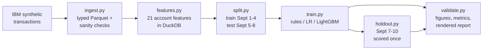

# AML Mule-Account Detection: Built and Validated Like a Bank Would

[](https://github.com/DhavalVibhakar99/aml-model-validation/actions/workflows/tests.yml)


A model that ranks bank accounts by money-laundering risk, and an **independent
validation** of it, structured like a model risk review under the Fed's SR 11-7
guidance. The model is half the project. The other half checks whether its
numbers can be trusted.

**[Read the full validation report →](reports/validation_report.md)**

---

## TL;DR

- **Problem:** rules-based transaction monitoring buries investigators in alerts.
  Here, six standard rules fire on 65,889 accounts at 1.2% precision.
- **Result:** at a budget of 500 reviewed accounts, LightGBM is **99% precise** and
  finds **10x as many launderers as a rules baseline tuned on the same data**.
- **The honest number:** on a frozen holdout scored once, PR-AUC is **0.322**. On
  launderers whose labels no design decision ever touched, it's **0.196**.
  That's the conservative figure, and the report explains the gap.

---

## Results

HI-Small test window (Sept 5-8, never used in training): 253,113 accounts,
2,747 involved in laundering (1.09%). "@500" means investigators review the top
500 accounts.

| Model | PR-AUC | Precision @500 | Recall @500 |
|---|---|---|---|
| Rules, hand-set thresholds | 0.016 | 7% | 1.3% |
| Rules, thresholds tuned on the train window | 0.019 | 10% | 1.9% |
| Logistic regression | 0.085 | 18% | 3.3% |
| **LightGBM** | **0.334** (CI 0.317-0.350) | **99%** | **18.0%** (max possible 18.2%) |

**Final holdout** (Sept 7-10), scored once with frozen models and file hashes recorded:

| LightGBM | PR-AUC | Precision @500 | Recall @500 | Lift vs tuned rules |
|---|---|---|---|---|
| All holdout positives | 0.322 | 93% | 17.3% | 8x |
| Fresh positives only (labels no decision had seen) | 0.196 | - | 12.5% | 8x |


## What the validation found

A single score would hide all of these:

1. **Use it as a ranking, not a probability.** The laundering rate doubled
   between the train and test windows, and the model under-predicts
   accordingly (mean prediction 0.59% vs 1.09% observed).
2. **The score drifted while no single feature did.** Score PSI was 0.42 on test,
   but no top feature crossed 0.25. On the holdout it was 0.03, which points to
   weekday mix rather than model decay. Monitoring has to watch both levels.
3. **About 40% of the signal is a simulator habit.** The generator routes most
   laundering through ACH. Without payment-format features, PR-AUC drops to 0.273,
   still 8x the tuned rules' recall.
4. **No memorization.** Accounts first seen in the test window rank as well as
   familiar ones (PR-AUC 0.356 vs 0.328).
5. **It transfers to a lower-risk population, with lower precision.** Trained on
   HI-Small and scored on LI-Small, precision at 500 falls to 36%. A model
   trained on LI itself does no better (30%), so the population is harder, not
   the model broken.
6. **The first framing was wrong, and the data shows why.** "Predict who
   launders in the next 48h" scores PR-AUC 0.031, because 27% of next-window
   launderers have no prior activity at all. The project switched to detection,
   which is what transaction monitoring actually does, and kept the failed
   framing in the report as evidence.

## How it works



**Features** (one row per account, from a 4-day window): fan-in and fan-out
counts, distinct counterparties, USD in/out, pass-through (how much of what
arrives leaves within 24h/48h), time from receiving to sending, burstiness,
payment-channel mix, cross-currency share, transfers just under the $10k
reporting threshold, and self-transfers.

## Design choices worth asking about

Each has a written rationale, with the alternatives considered, in
[DECISIONS.md](DECISIONS.md).

- **Time-based splits only.** Train and test periods don't overlap, and there
  are no random row splits, which would leak future behavior into training.
- **Leakage is tested, not assumed.** Adding transactions after the cutoff
  changes no feature, and features build identically with the label column
  deleted from the input.
- **The baseline is tuned, not a strawman.** Rule thresholds are tuned on the
  training window, and every lift number is measured against the tuned rules.
- **No accuracy, no rebalanced test sets, no tuning on test.** At a 1% base rate,
  flagging nobody scores 99% accuracy. Metrics are precision and recall at fixed
  alert budgets, PR-AUC with bootstrap intervals, calibration and PSI.
- **Every number in the report comes from a script.** The report is a template
  that `validate.py` fills in, so the prose can't drift from the results.
- **The holdout can only run once.** `holdout.py` records model hashes and the git
  commit, and it refuses to run a second time.

## Repository layout

```
src/
  download.py     fetch the two CSVs from Kaggle
  ingest.py       CSV -> typed Parquet, sanity checks
  features.py     account-level behavior features (DuckDB SQL)
  split.py        time windows and labels
  train.py        rules baseline (+ threshold tuning), LR, LightGBM
  metrics.py      precision/recall@K, PR-AUC, PSI, bootstrap intervals
  validate.py     all figures and numbers; renders the report
  holdout.py      one-shot final holdout
tests/            feature, leakage and metric tests (no data needed)
reports/
  validation_report.md    the model risk review
  figures/                PR curves, calibration, stress test, importance
  runs/                   JSON run logs (params + metrics per training run)
  holdout.json            the one holdout result
DECISIONS.md      every design decision, alternatives, and what would change it
```

## Reproduce it

Needs Python 3.11 and about 3 GB of free disk. On macOS, LightGBM also needs
`brew install libomp`.

```bash
make setup      # virtualenv + pinned requirements
make data       # download HI-Small / LI-Small (~1 GB) and convert to Parquet
make all        # split -> train -> validate; rebuilds reports/ (~2 min)
make test       # 26 tests
```

A clean rebuild reproduces every report number exactly. The holdout has
already been scored, and `make holdout` will refuse to run it again.

## Limitations

- **Synthetic data.** The laundering patterns come from a generator. The ACH
  reliance shows how a model picks up the generator's habits. These numbers show
  the method, not real-bank performance.
- **Short history.** There are 10 usable days, one backtest, and a holdout that
  half-overlaps the test window.
- **Perfect labels.** Real AML labels come from investigations and SARs, which
  are incomplete, delayed and shaped by the rules that raised the alerts.
- **No network features.** Counterparty risk is the most likely route to better recall.

Section 10 of the [report](reports/validation_report.md) has the full list.

## Data

Altman, E., Blanuša, J., von Niederhäusern, L., Egressy, B., Anghel, A., &
Atasu, K. (2023). *Realistic Synthetic Financial Transactions for Anti-Money
Laundering Models.* NeurIPS 2023 Datasets and Benchmarks Track. Hosted on
Kaggle at
[`ealtman2019/ibm-transactions-for-anti-money-laundering-aml`](https://www.kaggle.com/datasets/ealtman2019/ibm-transactions-for-anti-money-laundering-aml).

## License

MIT, see [LICENSE](LICENSE).
