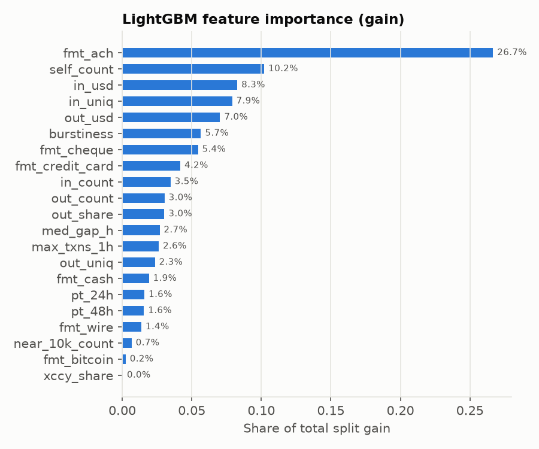
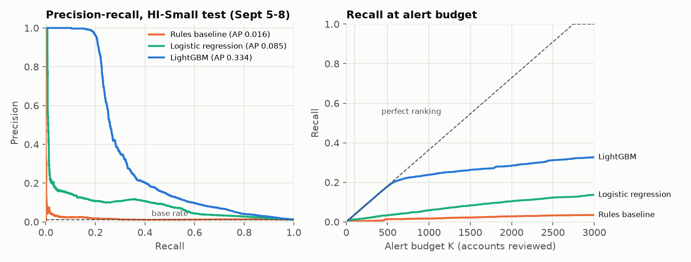
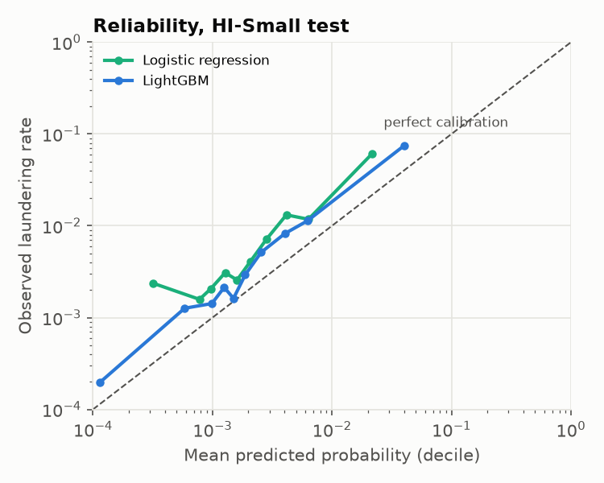
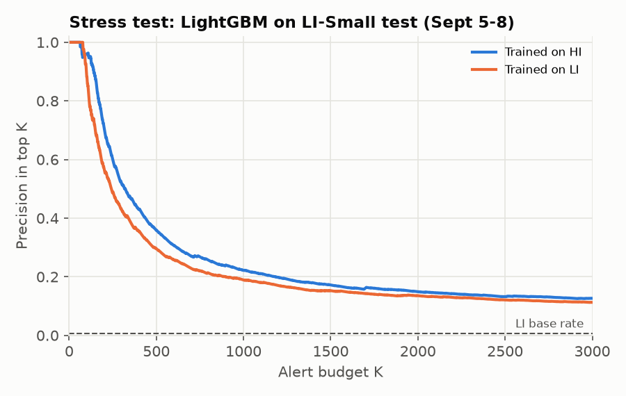

# Model Validation Report: Mule-Account Detection

*Structured as an independent model risk review in the spirit of Fed SR 11-7
(conceptual soundness, outcomes analysis, ongoing monitoring). Every number
in this document is generated by `src/validate.py` from run `20260927T203807Z`.
Rerun `make all` to rebuild it from the raw data.*

---

## Summary

| | |
|---|---|
| **Model** | LightGBM account classifier, 21 behavior features over a 4-day window |
| **Use** | Rank accounts for AML investigator review under a fixed alert budget |
| **Benchmark** | Six-rule transaction-monitoring baseline + logistic regression |
| **Headline** | At 500 alerts: **99% precision, 18.0% recall** vs 7% / 1.3% for rules (**13x** the recall) |
| **Opinion** | **Fit for purpose as an alert-prioritization model on this data, with conditions** (Section 10) |

Main findings:

1. **Ranking is strong where it matters.** The top 500 accounts are 99%
   laundering-involved. The best possible recall at 500 alerts is 18.2%, and the
   model gets 18.0%. Beyond about 600 alerts, precision falls off sharply.
2. **Probabilities are not calibrated for a new period.** The test base rate
   (1.09%) is about double the train rate (0.55%), and
   the model under-predicts accordingly. Use scores as ranks, not as probabilities.
3. **The score distribution moved (PSI 0.423) while no single top feature
   did.** A monitoring plan needs both levels, and a threshold on the score alone
   would have fired here.
4. **Part of the signal is a simulator habit.** Payment-format shares carry
   39.8% of the model's gain. Without them, PR-AUC drops 18%
   but the model still beats rules 11x on recall at 500.
5. **The originally proposed framing (predict the *next* 48h) doesn't work on this data**
   (PR-AUC 0.031), for reasons in the data, not the model (Section 8).

---

## 1. Purpose and scope

The model scores bank accounts on their recent transaction behavior so that
investigators can review the riskiest first. In a real bank this sits behind
or beside a rules-based transaction monitoring (TM) system, which generates
far more alerts than a team can clear.

The validation question is whether the model ranks laundering-involved accounts
above others, better than rules, in a period it has never seen, and what could
make that stop being true.

**Out of scope:** transaction-level detection, network/graph models,
case-management decisions, and any claim about real-bank performance (see
Limitations).

## 2. Data

**Source.** IBM synthetic AML transactions (Altman et al., 2023, *Realistic
Synthetic Financial Transactions for Anti-Money Laundering Models*, NeurIPS
Datasets & Benchmarks). HI-Small (higher illicit ratio) is the development set.
LI-Small (lower illicit ratio) is the stress-test set.

**Preparation** (`src/ingest.py`, `src/split.py`):

- Account identity is `bank_account`. Account strings repeat across banks.
- All amounts are converted to USD. The rates are the medians of implied rates
  from cross-currency transfers in the **training** window. The simulator's rates
  are fixed, so this is exact to about 4 significant figures.
- **Sept 11 onward is dropped.** It has only a few hundred transactions a day, and
  59% of them are laundering (HI-Small; 0.03%-0.21%
  per day before that). 86% of the laundering in that tail touches accounts
  that were already laundering. It is the generator finishing patterns it had
  started, not behavior to learn from.
- **Sept 1 is a seeding day.** 46% of its rows are self-transfers (vs
  2.1% on other days). Self-transfers are excluded from behavior features. A separate
  `self_count` feature counts only those after Sept 1.

**Windows.** Feature and label windows are the same 4 days (detection), and
train and test don't overlap.

| Dataset | Window | Dates | Accounts scored | Positives (detection) | Prevalence | Positives (forecast) | of which no history |
|---|---|---|---|---|---|---|---|
| HI-Small | train | Sept 1-4 | 399,774 | 2,215 | 0.55% | 1,459 | 206 |
| HI-Small | test | Sept 5-8 | 253,113 | 2,747 | 1.09% | 1,397 | 379 |
| LI-Small | train | Sept 1-4 | 546,129 | 1,979 | 0.36% | 1,221 | 150 |
| LI-Small | test | Sept 5-8 | 345,126 | 2,384 | 0.69% | 1,101 | 306 |

"Forecast" columns belong to the secondary analysis in Section 8. "No history"
means a positive with no activity in the feature window, which no history-based
model can score. These accounts stay in the recall denominator.

## 3. Conceptual soundness

### 3.1 Label and unit of prediction

The unit is the **account**. The label is 1 if the account sent or received at least one
laundering transaction **within the window its features describe**. This mirrors
how TM works: a system reviews an account's recent activity and asks whether
*that* activity was suspicious, and a SAR is filed on activity that has
already happened.

The project first used a forward-looking label (laundering in the following 48h).
It was replaced after evidence showed the data can't support it (Section 8,
DECISIONS #6). Both labels are built and reported.

### 3.2 Features

21 features, each with a plain-language meaning and a hand-computed unit test
(`tests/test_features.py`):

| Group | Features | What they capture |
|---|---|---|
| Fan-in / fan-out | `in_count`, `out_count`, `in_uniq`, `out_uniq` | many-to-one collection, one-to-many dispersal |
| Flow | `in_usd`, `out_usd`, `out_share` | size and direction of money movement |
| Pass-through | `pt_24h`, `pt_48h`, `med_gap_h` | how much of what arrives leaves quickly, and how fast |
| Channel | `fmt_ach`, `fmt_bitcoin`, `fmt_cash`, `fmt_cheque`, `fmt_credit_card`, `fmt_wire`, `xccy_share` | payment-method mix, currency conversion |
| Structuring | `near_10k_count` | transfers in the $8k-$10k band under the CTR threshold |
| Timing | `burstiness`, `max_txns_1h` | quiet-then-flurry activity (Goh & Barabasi burstiness) |
| Self-transfers | `self_count` | own-account movements after seeding |

### 3.3 Leakage controls

- One SQL CTE is the only entry point for transactions and filters to
  `start <= ts < cutoff`. `tests/test_leakage.py` shows that adding rows at or
  after the cutoff, or before the start, changes no feature. That includes a row
  on the exact cutoff minute.
- Shuffling `is_laundering` changes no feature, so the label never reaches the inputs.
- Train (Sept 1-4) and test (Sept 5-8) periods are disjoint, and a test asserts it.
- FX rates, rule thresholds and all hyperparameters come from the training
  window or are fixed. There was no tuning, because the only window left to tune
  on is the test window.
- No resampling or class weights anywhere. The test set is the natural population.

### 3.4 Model choice

- **Rules baseline:** six standard typologies (rapid movement, fan-in, fan-out,
  structuring, velocity, high-risk channel), with thresholds sanity-checked on the
  training window. Accounts are ranked by the number of rules hit, with ties broken
  by dollar flow, the way an alert queue is usually sorted. There is deliberately
  no "ACH rule", even though the data would reward one, because that would tune
  the baseline to the answer.
- **Logistic regression:** log-transformed counts and amounts, standardized.
  It serves as the interpretable challenger.
- **LightGBM:** 400 trees, learning rate 0.03, `min_child_samples=200` (there are only
  2,215 training positives, so small leaves would memorize them).

The rules, one at a time on the test window:

| Rule | Alerts | Precision | Positives caught |
|---|---|---|---|
| R1_rapid_movement | 19,476 | 1.9% | 370 |
| R2_fan_in | 3,254 | 6.0% | 195 |
| R3_fan_out | 9,674 | 1.7% | 165 |
| R4_structuring | 14,686 | 1.2% | 172 |
| R5_velocity | 21,712 | 1.7% | 378 |
| R6_high_risk_channel | 16,366 | 0.3% | 42 |
| **any rule** | 65,889 | 1.2% | 807 |

Firing on **any** rule gives 65,889 alerts at 1.2% precision.
That is realistic for TM, and it is the problem this model is meant to solve.

### 3.5 What the model relies on



The top drivers are `fmt_ach` (26.7% of gain), `self_count` (10.2%)
and `in_usd` (8.3%). ACH carries most of the simulator's laundering,
so the model has learned the generator's channel preference. That is legitimate
on this data but would not transfer as-is to a real bank.

**Ablation.** Retraining without the six payment-format features
(15 features left) gives PR-AUC 0.273 (down 18%),
85% precision at 500 and 20.9% recall at 1,000. Most of the
signal comes from fan-in, flow and timing behavior, not from the channel.

**Logistic regression coefficients** (top 8 by magnitude, standardized inputs):

| Feature (standardised) | Coefficient | Odds ratio per 1 sd |
|---|---|---|
| `in_uniq` | +0.85 | 2.33 |
| `fmt_ach` | +0.57 | 1.77 |
| `out_uniq` | +0.55 | 1.74 |
| `out_count` | -0.48 | 0.62 |
| `max_txns_1h` | -0.39 | 0.68 |
| `out_usd` | +0.38 | 1.47 |
| `fmt_cheque` | -0.30 | 0.74 |
| `in_usd` | +0.28 | 1.33 |

The signs mostly make sense: more distinct counterparties and more ACH raise risk,
while cheque use lowers it. The negative signs on `out_count` and
`max_txns_1h` come from collinearity with the distinct-counterparty counts, not
from a real protective effect. That is a reason not to read LR coefficients one
at a time. It does not affect the LightGBM result.

## 4. Outcomes analysis

HI-Small test window (Sept 5-8), 2,747 positives among
253,113 accounts (base rate 1.09%). P@K and R@K are the
precision and recall when investigators review the top K accounts.

| Model | PR-AUC [95% CI] | P@100 | R@100 | P@500 | R@500 | P@1000 | R@1000 | Lift vs rules (R@500) |
|---|---|---|---|---|---|---|---|---|
| Rules baseline | 0.016 [0.015-0.018] | 9% | 0.3% | 7% | 1.3% | 5% | 1.7% | - |
| Logistic regression | 0.085 [0.078-0.093] | 34% | 1.2% | 18% | 3.3% | 16% | 5.8% | 2.5x |
| LightGBM | 0.334 [0.317-0.350] | 100% | 3.6% | 99% | 18.0% | 65% | 23.8% | 13.4x |



- **The top of the ranking is almost perfect.** The first 100 alerts are 100% positive,
  and at 500 alerts the model finds 494 of a possible 500. The best possible
  recall at 500 is 18.2%, and the model gets 18.0% (95% CI 17.3%-18.6%).
- **The tail is hard.** Past about 600 alerts precision falls quickly (65%
  at 1,000). Many positives look like ordinary accounts in a 4-day window.
- **Lift over rules** in recall is 11x at 100, 13x at 500 and
  14x at 1,000.
- **Logistic regression** (PR-AUC 0.085) is well behind LightGBM. The
  signal is mainly in interactions (e.g. ACH *and* pass-through *and* few
  counterparties), which a linear model can't represent.
- **Overfitting check:** LightGBM PR-AUC is 0.371 in-sample vs
  0.334 out-of-time, a small gap.

Intervals come from 200 bootstrap resamples of test accounts.

## 5. Calibration



| | Brier score | Mean predicted | Observed rate |
|---|---|---|---|
| LightGBM | 0.00868 | 0.59% | 1.09% |
| Logistic regression | 0.01050 | 0.42% | 1.09% |
| Constant base rate (reference) | 0.01074 | 1.09% | 1.09% |

Both models sit **above** the diagonal: they under-predict. This isn't a
modelling defect. The laundering rate among active accounts roughly doubled
between the windows (0.55% to 1.09%), partly
because the train window includes the high-volume Sept 1-2 days and a weekend,
which dilutes the rate. A model trained on one base rate will under-predict a period with twice
the rate. Scores should be used as a **ranking** for alert prioritization.
If probabilities are needed (e.g. for capacity planning), they have to be recalibrated on
recent labelled data.

## 6. Stability and ongoing monitoring

Population stability index, train window vs test window (HI-Small). Features are
the top 8 by LightGBM gain. Bands: < 0.10 stable, 0.10-0.25 monitor,
> 0.25 shifted.

| Variable | PSI | Status |
|---|---|---|
| Logistic regression score | 0.275 | shifted |
| LightGBM score | 0.423 | shifted |
| `fmt_ach` | 0.010 | stable |
| `self_count` | 0.000 | stable |
| `in_usd` | 0.096 | stable |
| `in_uniq` | 0.248 | monitor |
| `out_usd` | 0.111 | monitor |
| `burstiness` | 0.117 | monitor |
| `fmt_cheque` | 0.106 | monitor |
| `fmt_credit_card` | 0.110 | monitor |

The **score** PSI is 0.423, in the "shifted" band, but none of the top features is: 0 are
above 0.25, and the largest is `in_uniq` at 0.248. Many small shifts
(weekday mix, the Sept 1-2 volume in train) add up in the score, together with
the real doubling of positives. Monitoring the features alone would have missed this.

**Proposed monitoring plan**

| Metric | Frequency | Amber | Red / action |
|---|---|---|---|
| Score PSI vs last validated window | weekly | > 0.10 | > 0.25: investigate drivers before next run |
| Top-10 feature PSI | weekly | > 0.10 | > 0.25 on any: check upstream data |
| Precision of worked alerts (top 500) | monthly | < 80% | < 60%: trigger revalidation |
| Rules-only hits missed by the model | monthly | trend up | review sample; possible new typology |
| Base rate of confirmed cases | monthly | 1.5x change | recalibrate before using probabilities |

Weekly PSI on synthetic weekday effects will be noisy, so compare like-for-like
weeks once there is enough history.

## 7. Stress test: train on HI-Small, apply to LI-Small

LI-Small is generated the same way with about half the illicit ratio. The LI
test window (Sept 5-8) has 2,384 positives among 345,126
accounts (0.69%).

| Model | PR-AUC | P@100 | P@500 | P@1000 | R@100 | R@500 | R@1000 |
|---|---|---|---|---|---|---|---|
| LightGBM trained on HI | 0.119 | 96% | 36% | 22% | 4.0% | 7.5% | 9.3% |
| LightGBM trained on LI (reference) | 0.100 | 89% | 30% | 19% | 3.7% | 6.2% | 7.9% |
| Logistic regression trained on HI | 0.035 | 9% | 10% | 9% | 0.4% | 2.1% | 3.6% |
| Rules baseline | 0.010 | 3% | 3% | 4% | 0.1% | 0.5% | 1.6% |



- **Precision drops sharply** (99% → 36% at 500), and recall at
  1,000 goes from 23.8% to 9.3%. Part of this is simply fewer
  positives (base rate 1.09% → 0.69%), but the drop is
  bigger than that alone would explain. LI's positives are harder to separate
  at this budget.
- **The model isn't what broke.** The HI-trained model (PR-AUC 0.119)
  does *at least as well* as the same recipe trained on LI's own training window
  (0.100). HI has more positives to learn from, and the laundering
  behavior is the same in both datasets.
- **Prior correction doesn't fix calibration here.** Rescaling for the HI→LI
  training base rates (0.55% → 0.36%, Saerens et al. 2002) moves the mean
  prediction from 0.46% to 0.31%, while the observed rate is
  0.69%. The Brier score goes from 0.00643 to 0.00649. The correction
  pushes the right way for the dataset shift, but the larger shift is
  window-to-window *within* each dataset (Section 5), and it goes the other way.
  The rescaling doesn't change the ranking: the top 1,000 are identical.

The takeaway is that a lower-prevalence population needs a smaller alert
budget or a lower precision expectation. Retraining alone isn't enough, and
calibration has to be based on recent outcomes, not an assumed prior.

## 8. Secondary analysis: the forward-looking label

The originally proposed label was laundering in the **48 hours after** the
feature window. Under that label (same features, same model recipe):

- PR-AUC is 0.031 on test vs 0.354 in-sample, which is heavy
  overfitting. Precision at 500 is 9% and recall at 1,000 is 4.9%.
- Of 1,397 forecast positives, **379 (27.1%) had no
  activity at all** in the feature window, and only **229
  (16.4%)** were laundering during it. In this simulator,
  laundering mostly doesn't continue from one window into the next, so a
  history-based forecast has little to work with, whatever the model.

Forward-looking detection would need longer history, persistent account
behavior, or network features that reach the accounts about to be used. The
evidence is kept in `reports/runs/` (the first run log is the forecasting run).

## 9. Limitations

- **Synthetic data.** The laundering typologies and channel preferences come from a generator.
  Real performance would differ, probably by a lot. The ACH reliance shows
  how a model picks up the generator's habits.
- **10 usable days, one backtest.** There is a single train/test cutoff. A real validation
  would roll the cutoff across months and report the spread.
- **Perfect labels.** Every laundering transaction is labelled. Real AML labels
  come from SARs and investigations, which are incomplete, delayed and biased
  toward what existing rules already catch.
- **No network features.** Counterparty risk (e.g. sending to an account that
  itself scores high) is not used. It is the most likely route to better tail recall.
- **Account-level unit with a 4-day window.** Accounts active only briefly
  have little history, so their features are thin.
- **Fixed hyperparameters.** They were not tuned, so the numbers are likely
  somewhat conservative.

## 10. Conclusion and conditions

On this data, LightGBM is a large improvement over the rules baseline for
prioritizing alerts: 13x the recall at a 500-alert budget, with
near-perfect precision at the top of the queue. The validation supports using
it **as a ranking layer**, subject to:

1. **Use ranks, not probabilities**, until it has been recalibrated on recent confirmed outcomes.
2. **Run score and feature PSI monitoring** (Section 6). A red score PSI triggers
   a driver analysis before the next production run.
3. **Keep the rules running in parallel** and review rules-only hits, so that
   typologies the model hasn't seen still surface.
4. **Revalidate on real data** before any production use. The channel reliance
   (Section 3.5) in particular has to be re-examined.

## Reproduction

```
make data      # download the two CSVs (kagglehub) and ingest to Parquet
make all       # split -> train -> validate; rebuilds this report
make test      # unit + leakage tests (no data needed)
```

Design decisions and the alternatives considered are in `DECISIONS.md`.
